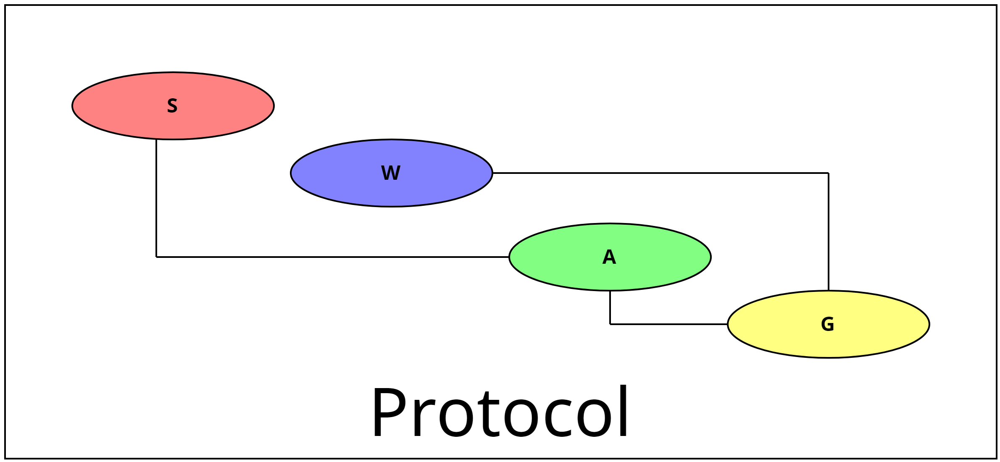

## [Protocol](./protocol) - [Meeting Notes](./meetings)

A chat protocol for a meshed server-less network using Split Horizon & Poise Reverse by Group 2 of RNP @ HAW Hamburg ITS.

## Generated PDFs can be found [HERE](https://github.com/HAW-RN/protocol/actions/workflows/build.yml)
