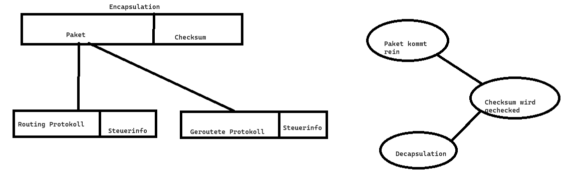

# Date: 27.05.2024

# Participants

- Tom Hert
- Daniil Khoma
- Laurin Zacharias
- Tom Westendorf
- Eike Balling
- Jeremy Reimers
- Alexander Kelsch
- Bastian Basler
- Ruben Marin Grez
- Tim Hagedorn
- Michael German
- Martin Becke
- Andrii Lysyi

# Agenda

- Short recap for Tom Westendorf
- Showcase of current progress
- Plans for next time

# Recap

## Routing protocol

/

## Routed protocol

/

## Coding

- Consider using a Common Header for both routed and routing protocol

## Use Case

- Showcase of Laurin's use cases

## Organizational issues

- Jeremy Reimers and Tom Westerndorf will join the Routed Protocol team

- Next Meeting will be a showcase of a minimal proof of concept version of each teams work

- Deadline for Coding team to decide on format till Wednesday, 29.05.2024 by announcing it in the Teams Channel