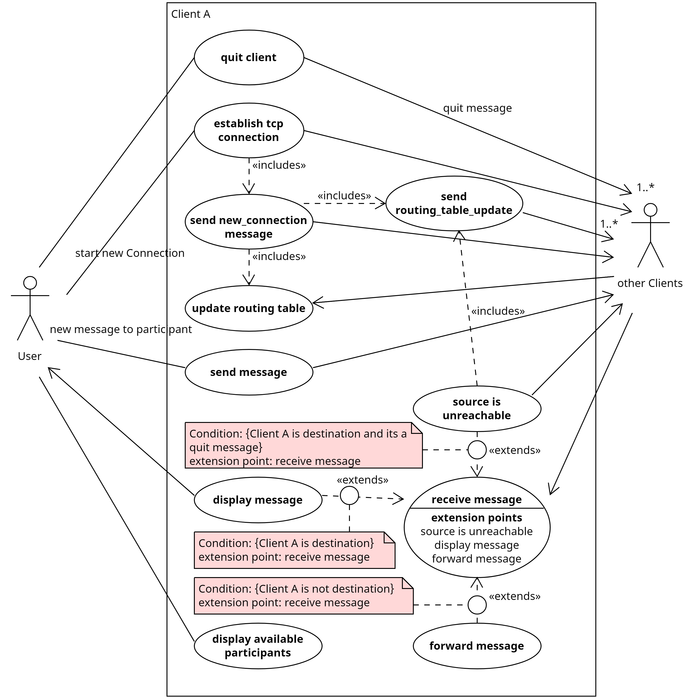

# Use-Cases

### 1. Start New Connection
Client A establishes a connection to another Client B using TCP. Client A sends a CR message to Client B which responds with its routing table, updating Client A's routing table. Both Clients add information about the connection to their routing tables.

### 2. Forward Message
Client A receives a message and checks its destination address. If Client A is not the destination, it checks its routing table for the destination address and sends the message to the destination, if directly connected or to the next address on the route, if one is available.

### 3. Update Routing Table
Every 10 seconds Client A requests all directly connected Clients to send a SCCR containing all information in their routing table besides the routing information it got from Client A. When receiving SCCR, Client A will update its routing table with any new information from it. If a Client does not answer this request, they will marked as unavailable in the routing table.

### 4. Send Routing Table
When requested Client A sends a SCCR to the requesting Client containing all information in Client A's routing table besides the information it got from the requesting Client.

### 5. Quit Client
Client A sends a quit_message? to all directly connected Clients. Afterwards the program ends itself.

### 6. source is unavailable
Client A marks all routes in its routing table reachable through the source including the source itself as unreachable and sends a routing table update.

#### Client specific
Client specific use cases are use cases whos details are up to the implementing clients, these include:
- send message
- receive message
- display message
- display available participants
