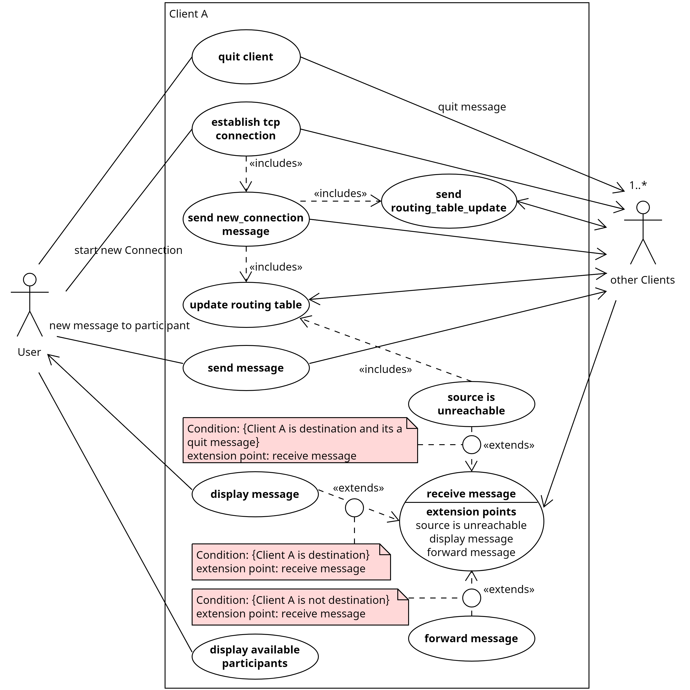

# Use-Cases

### 1. Start New Connection:
Client A establishes a connection to another Client B using TCP. Client A sends a new_connection message to Client B which responds with its routing table, updating Client A's routing table. Both Clients add information about the connection to their routing tables.

### 2. Forward Message:
Client A receives a message and checks its destination address. If Client A is not the destination it checks its routing table for the destination address and sends the message to the destination if directly connected or to the next address on the route if one is available.

### 3. Routing Table Update:
Every X seconds Client A sends a routing_table_update to all directly connected Clients containing all information in Client A's routing table besides the routing information it got from the individual Clients. When receiving routing_table_update Client A will update its routing table with any new information from it.

### 4. Quit Client
Client A marks all routes reachable through it including itself as unreachable and sends a routing table update 

#### Client specific
- send message
- receive message
- display message