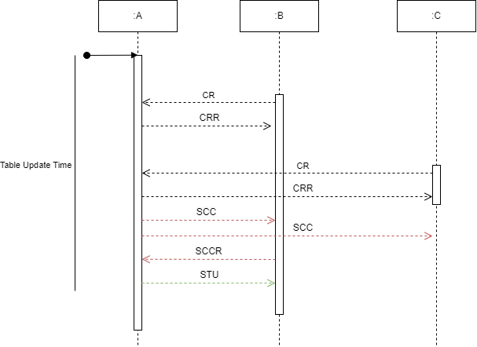

# Routing protocol (participants)
    Bastian Basler, Tim Hagedorn, Ruben Marin Grez, Eike Balling
## Requirements
#### Prerequisites
- Participants have to be in the same Network
- Participants must be able to send and receive packages via IPv4 
- Participants must be reachable via their IPv4 address 
- Participants must have a Timer 
- A connecting participant has to know the IPv4 address and Port of the participant they want to connect to

#### Protocol Requirements
- Every Participant has to be able to start and shutdown themselves 
- Every Participant has to be able to give back a List of all Participants at any time 
- There shall be no central Node
Participants must be able to forward Messages 
- The participants must form any partially meshed network
- Participants may send Messages to themselves

## Packet format
### Header
See "Shared Header" section

### Table
| target_ip | target_port | next_ip  | next_port | hop_count  |   
|---|---|---|--|---|
|  192.168.101.12 | 1234 | 192.168.101.13 | 1243  | 2 |   
|  10.0.0.5 | 1234 | 10.0.0.3 | 1234  | 4 |
|  10.0.0.11 | 1234 | 10.0.0.6 | 1234  | 2 |

### Example Data

```json
{
  "header":     {[...]}, // SEE SHARED HEADER
  "table": [
    {
      "target_ip": "10.0.0.5",
      "target_port": 1234,
      "next": "10.0.0.3",
      "next_port": 1234,
      "hop_count": 4
    },
    {
      "target_ip": "10.0.0.11",
      "target_port": 1234,
      "next_ip": "10.0.0.6",
      "next_port": 1234,
      "hop_count": 2
    }
  ]
}

```

## Packet Types

Defined within the `type_id` field of the common header.

| ID | Type          | Description                |
|----|---------------|----------------------------|
| 2  | CR            | Connection Request (Send Routingtable)  |
| 3  | CRR           | Connect Request Reply (Send Routingtable)  |
| 4  | SCC           | Send Connection Check  |
| 5  | SCCR          | Connection Check Reply  |
| 6  | STU           | Send Table Update (Send Routingtable)  |

## Procedure
1. Participant A starts the Application and sets internal Table update Timer to 30 seconds
2. Participant B sends CR to Participant A and sends current Routingtable
3. Participant A accepts CR from Participant B and answers CRR and sends current Routingtable 
4. Participant A updates Routingtable based on the received Table
5. After A´s Timer expired A sends SCC to all next entrances in its Routingtable
6.  Participant A updates Routingtable based on received SCCRs
    1. If SCCR isn´t received after one second Participant A sets Hop Count to 16 (Poison Reverse)
7. Participant A sends STU to all active Participants
8. Participant A resets Timer to 30 seconds

## Example
